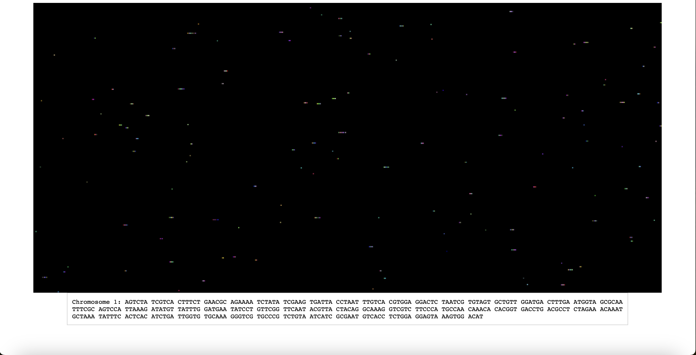

# Gene Sequencing Simulation

## Introduction

This interactive JavaScript simulation visualizes gene sequencing and chromosome formation, utilizing the HTML5 canvas for dynamic rendering. It's an educational tool, demonstrating the principles of genetics through programmed motion and grouping behavior of gene sequence representations.

## Key Features

- **Dynamic Animation**: Sequences move and interact within the canvas, simulating the stochastic nature of gene sequencing.
- **Chromosome Formation**: Simulated chromosomes are formed when groups of sequences combine, each containing 2000 genes to align with the constraints of the simulation.
- **Educational Purpose**: Serves as an illustrative guide to the basics of genetic sequencing and chromosome organization, making complex concepts accessible to learners.

## Simulation vs. Reality

In this simulation, chromosomes are simplified to contain 2000 genes for illustrative purposes. However, in reality, chromosomes comprise billions of genes, and gene sequencing is a highly complex process that involves sophisticated and expensive hardware, far beyond the scope of this educational model.

## Project Screenshot

## Running the Simulation

Open the `index.html` file in a modern web browser to start the simulation.

## Acknowledgments

All programming for this project was done by me in collaboration with AI. The concepts and skills required for the development were covered in the Udemy course: "Fast and Furious Game Development with JavaScript and AI."

[Course Link](https://www.udemy.com/course/fast-and-furious-game-development-with-javascript-and-ai/)
